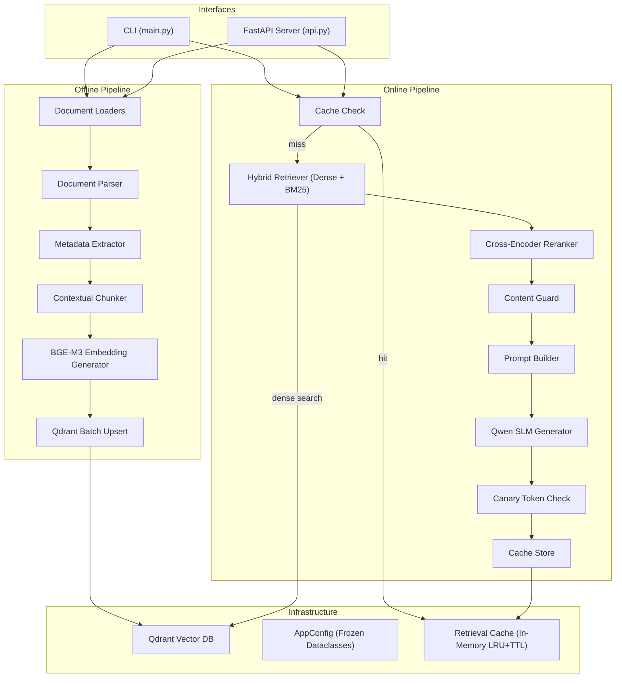
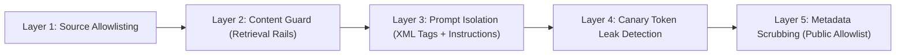

# Banking RAG Pipeline — Architecture Overview

## System Identity
**Union Bank of India Enterprise Banking RAG System** — a production-grade Retrieval-Augmented Generation pipeline built with Clean Architecture and SOLID principles, targeting Indian banking regulatory & compliance domains (AML/KYC, Compliance, Risk, Internal Audit, Board Secretariat).

---

## High-Level Architecture



---

## Two Pipelines

### 1. Offline Ingestion Pipeline
**Entry:** `python main.py ingest --path ./data`
**Orchestrator:** [OfflineIngestionPipeline](file:///Users/rohinivemula/Desktop/RAG_2/banking_rag/pipeline/ingest.py)

```
Document (PDF/DOCX/TXT/JSONL)
  │
  ▼
┌──────────────────────────────────────────────────────────────┐
│ 1. Document Loading         (loaders/)                      │
│    ├── PDFLoader            → pypdf page-by-page extraction │
│    ├── DocxLoader           → python-docx paragraph reader  │
│    ├── TextLoader           → UTF-8 raw text reader         │
│    └── JSONLLoader          → streaming line-by-line JSONL  │
│                                                              │
│ 2. Parsing & Cleaning       (parser/parser.py)              │
│    └── DocumentParser       → text normalization, cleanup   │
│                                                              │
│ 3. Metadata Extraction      (metadata/metadata_extractor.py)│
│    └── Rule-based regex extraction of:                       │
│        regulator, domain, doc_type, section, chapter,        │
│        clause, date, version                                 │
│                                                              │
│ 4. Contextual Chunking      (chunking/)                     │
│    ├── RecursiveTextChunker → hierarchical splitting         │
│    │   (separators: ¶¶ → ¶ → ". " → "; " → " " → char)    │
│    │   chunk_size=512, overlap=64                            │
│    └── ContextualChunker    → prepends metadata headers     │
│        "[Context: Regulator: X | Domain: Y | Document: Z]"  │
│                                                              │
│ 5. Embedding Generation     (embeddings/)                   │
│    └── BGEEmbeddingGenerator (BAAI/bge-m3)                  │
│        1024-dim dense vectors, batch_size=32,                │
│        normalized, max_seq_length=1024                       │
│                                                              │
│ 6. Vector DB Upsert         (vectorstore/qdrant_manager.py) │
│    └── Qdrant batch upsert (batch_size=500)                 │
│        collection: "union_bank_knowledge_base"               │
│        distance: COSINE                                      │
└──────────────────────────────────────────────────────────────┘
```

> [!IMPORTANT]
> Ingestion enforces a **source allowlist** — files must reside under configured `INGESTION_ALLOWED_ROOTS` (defaults to `./data`, `./banking_rag/data`). Symlinks are resolved before the check to prevent bypass.

---

### 2. Online RAG Query Pipeline
**Entry:** `python main.py query -q "..."` or interactive mode, or `POST /query` via FastAPI
**Orchestrator:** [OnlineRAGPipeline](file:///Users/rohinivemula/Desktop/RAG_2/banking_rag/pipeline/rag_pipeline.py)

```
User Query
  │
  ▼
┌──────────────────────────────────────────────────────────────┐
│ 1. Cache Check              (cache/retrieval_cache.py)      │
│    └── In-memory LRU + TTL cache (default 1h, max 1000)     │
│        Key = hash(query + filters + top_k)                   │
│        Hit → return cached RAGResponse immediately           │
│                                                              │
│ 2. Hybrid Retrieval         (retrieval/)                    │
│    ├── DenseRetriever                                        │
│    │   └── BGE-M3 query embedding → Qdrant cosine search    │
│    │       top_k = request_top_k × 4                         │
│    ├── BM25 Sparse Retriever (in-memory term matching)       │
│    │   └── Term frequency scoring over dense candidates      │
│    └── Reciprocal Rank Fusion (RRF)                          │
│        └── RRF_score(doc) = Σ 1/(k + rank)  (k=60)          │
│                                                              │
│ 3. Cross-Encoder Reranking  (retrieval/reranker.py)         │
│    └── BAAI/bge-reranker-large                               │
│        Scores (query, chunk) pairs → top_k=5 by default      │
│                                                              │
│ 4. Content Guard            (retrieval/content_guard.py)    │
│    └── Heuristic injection detection (regex patterns)        │
│        Modes: "flag" (annotate) or "block" (drop)            │
│        Detects: prompt injection patterns, imperative openers│
│                                                              │
│ 5. Prompt Construction      (prompts/prompt_builder.py)     │
│    ├── System prompt: strict compliance officer persona      │
│    │   with anti-injection rules & canary token               │
│    └── User prompt: <retrieved_context> XML-wrapped chunks   │
│        + user question + citation format requirement          │
│                                                              │
│ 6. LLM Generation           (llm/generator.py)             │
│    └── Qwen/Qwen2.5-3B-Instruct                             │
│        temp=0.1, top_p=0.9, max_tokens=1024                  │
│        Chat template via apply_chat_template()                │
│                                                              │
│ 7. Canary Token Leak Check                                   │
│    └── If canary token appears in output → REDACT + log      │
│                                                              │
│ 8. Citation Extraction                                       │
│    └── format_citation() from chunk metadata                 │
│        "[Source: X | Regulator: Y | Section: Z | Page: N]"   │
│                                                              │
│ 9. Cache Store                                               │
│    └── Store RAGResponse in LRU cache for future queries     │
└──────────────────────────────────────────────────────────────┘
  │
  ▼
RAGResponse { answer, citations[], retrieved_chunks[], cached, metadata }
```

---

## Module Map

| Module | Key Files | Purpose |
|--------|-----------|---------|
| **loaders/** | `base_loader.py`, `pdf_loader.py`, `docx_loader.py`, `text_loader.py`, `jsonl_loader.py` | Strategy pattern — each loader handles one file type |
| **parser/** | `parser.py` | Text normalization & cleanup post-loading |
| **metadata/** | `metadata_extractor.py` | Rule-based regex extraction of banking metadata (regulator, domain, section, etc.) |
| **chunking/** | `chunker.py`, `contextual_chunker.py` | Recursive text splitting (512 chars, 64 overlap) + contextual header prepending |
| **embeddings/** | `embedding_generator.py` | BGE-M3 (1024-dim) dense embedding with process-level singleton cache |
| **vectorstore/** | `qdrant_manager.py` | Qdrant collection management, batch upsert, cosine similarity search |
| **retrieval/** | `retriever.py`, `hybrid_retriever.py`, `reranker.py`, `filters.py`, `content_guard.py` | Dense retrieval → BM25 sparse → RRF fusion → cross-encoder rerank → content guard |
| **prompts/** | `prompt_builder.py` | System/user prompt construction with XML-wrapped context + canary tokens |
| **llm/** | `generator.py` | Qwen2.5-3B-Instruct generation with canary redaction |
| **cache/** | `cache_manager.py`, `retrieval_cache.py` | In-memory LRU + TTL query-response cache |
| **pipeline/** | `ingest.py`, `rag_pipeline.py` | Orchestrators tying all modules together |
| **config.py** | — | Frozen dataclass config hierarchy loaded from env vars |
| **constants.py** | — | Enums, defaults, metadata keys, security patterns |
| **exceptions.py** | — | Domain-specific exception hierarchy |
| **utils/** | `logger.py`, `file_utils.py`, `text_utils.py` | Logging, file discovery, text/citation utilities |

---

## Model Stack

| Role | Model | Dimension / Details |
|------|-------|---------------------|
| **Embedding** | `BAAI/bge-m3` | 1024-dim dense, normalized, max_seq_length=1024 |
| **Reranker** | `BAAI/bge-reranker-large` | Cross-encoder scoring (query, chunk) pairs |
| **Generator (SLM)** | `Qwen/Qwen2.5-3B-Instruct` | temp=0.1, top_p=0.9, max_new_tokens=1024 |
| **Vector DB** | Qdrant | Server or embedded mode, cosine distance |

---

## Security Layers



| Layer | What It Does | Module |
|-------|-------------|--------|
| **1. Source Allowlisting** | Restricts ingestion to approved directories; resolves symlinks | [ingest.py](file:///Users/rohinivemula/Desktop/RAG_2/banking_rag/pipeline/ingest.py#L40-L84) |
| **2. Content Guard** | Heuristic regex screening of retrieved chunks for injection patterns | [content_guard.py](file:///Users/rohinivemula/Desktop/RAG_2/banking_rag/retrieval/content_guard.py) |
| **3. Prompt Isolation** | `<retrieved_context>` XML wrapping + system-prompt rules against following injected instructions | [prompt_builder.py](file:///Users/rohinivemula/Desktop/RAG_2/banking_rag/prompts/prompt_builder.py) |
| **4. Canary Tokens** | Random per-request token in system prompt; if echoed in output → redact + alert | [rag_pipeline.py](file:///Users/rohinivemula/Desktop/RAG_2/banking_rag/pipeline/rag_pipeline.py#L121-L141), [generator.py](file:///Users/rohinivemula/Desktop/RAG_2/banking_rag/llm/generator.py#L202-L230) |
| **5. Metadata Scrubbing** | Only `PUBLIC_CITATION_METADATA_KEYS` are exposed in citations/API responses | [constants.py](file:///Users/rohinivemula/Desktop/RAG_2/banking_rag/constants.py#L99-L113) |

---

## Configuration Architecture

[config.py](file:///Users/rohinivemula/Desktop/RAG_2/banking_rag/config.py) uses **frozen dataclasses** loaded from environment variables:

```
AppConfig (root)
├── QdrantConfig       → connection mode, host, port, API key, collection
├── ModelConfig        → embedding/reranker/SLM model names, device, revision SHAs
├── ChunkingConfig     → chunk_size=512, overlap=64, contextual chunking toggle
├── RetrievalConfig    → top_k_dense=20, top_k_sparse=20, top_k_reranked=5, RRF k=60
├── CacheConfig        → enable, TTL=3600s, max_size=1000
├── IngestionConfig    → allowed source roots, batch sizes, allowlist enforcement
└── SecurityConfig     → content guard toggle/action, canary tokens, Qdrant auth enforcement
```

---

## API Surface (FastAPI)

[api.py](file:///Users/rohinivemula/Desktop/RAG_2/banking_rag/api.py) exposes:

| Endpoint | Method | Purpose |
|----------|--------|---------|
| `/query` | POST | Execute RAG query → returns `{answer, citations, cached, metadata}` |
| `/ingest` | POST | Ingest document file/directory into Qdrant |
| `/health` | GET | Component health check (embedding, reranker, LLM, Qdrant connectivity) |

The RAG pipeline is built **once** during FastAPI lifespan startup and reused for all requests.

---

## Key Design Patterns

- **Dependency Injection**: All pipeline components accept optional constructor args, defaulting to production implementations
- **Process-level Singleton Caches**: Models (embedding, reranker, SLM) and Qdrant clients use class-level `_model_cache` dicts with thread-safe locks — loaded once per process regardless of instance count
- **Strategy Pattern**: Loaders, retrievers, rerankers all implement abstract base classes
- **Lazy Loading with Preload**: Models are lazy-loaded on first use, but `preload()` methods force eager loading at startup
- **Batch Processing**: Ingestion processes documents in configurable batches to manage memory
