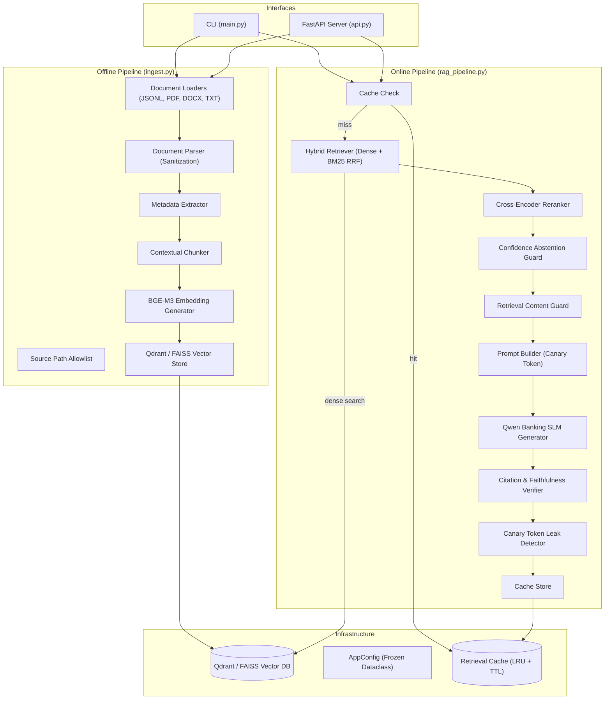

# Banking RAG Pipeline — Architecture Overview

> **Primary Architecture Documentation:** See [architecture.md](file:///Users/rohinivemula/Desktop/EUCLID/RAG_2/architecture.md) for the complete engineering deep-dive, security architecture, data schemas, and pipeline specifications.

---

## High-Level Architecture Summary

---

## System Subsystems

1. **Ingestion & Data Normalization**: Robust multi-format parsing with invisible Unicode stripping and metadata tagging (Regulator, Domain, Section, Date).
2. **Hybrid Search Engine**: BGE-M3 dense embeddings fused with BM25 term frequency scores via Reciprocal Rank Fusion ($k=60$).
3. **Cross-Encoder Reranker**: `BAAI/bge-reranker-large` re-scoring candidates for precision context selection.
4. **Security & Abstention Rails**: Content guard heuristic injection screening, per-request canary tokens, citation grounding verification, and metadata exposure scrubbing.
5. **Generative SLM Engine**: Fine-tuned `Qwen2.5-3B-Instruct` model generating objective, citation-backed compliance responses.
